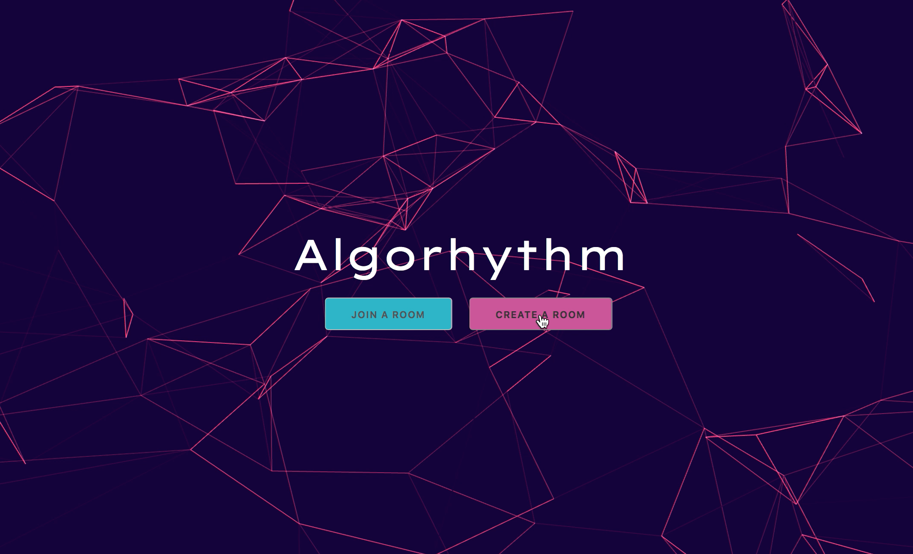
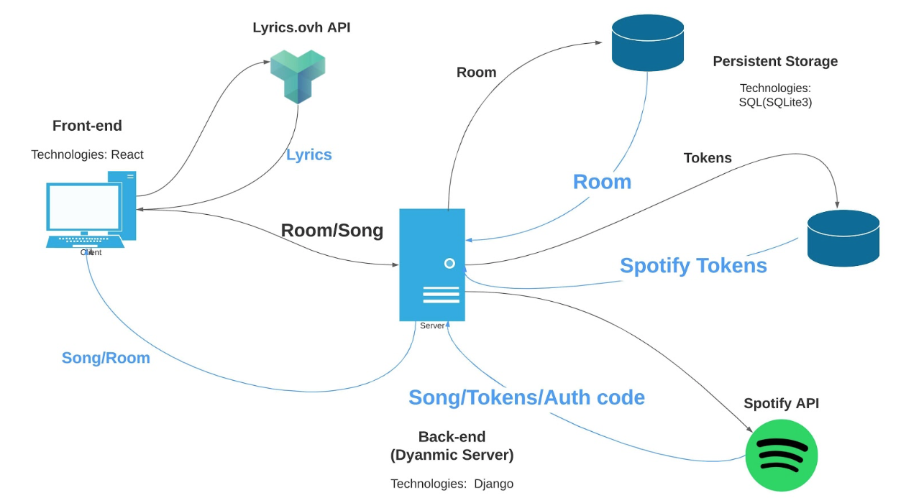

# Algorhythm

A music app that brings family and friends together through a shared love of music. 

The idea is that the host sets up a room and controls the music. The host can then invite others to join their music room by sending them a code. Once listeners join, the host may give them the rights to vote if they want to pause or skip the currently playing song.

<!--  -->

## Installation & Usage

- `git clone` this repository and `cd` into it
- Install requirements by running `pipenv install -r requirements.txt`
- Activate your virtual environment by running `pipenv shell`
- Run `cd algorhythm` and start server
    `python manage.py runserver`
- See the app in action at
    `http://localhost:8000/`

To start the React app
- `cd` into algorhythm/frontend
- run `npm start`

## Algorhythm System

## Technologies

Python | Django | JavaScript | React | Webpack | Babel | SQLite3

## Wins & Challenges

- Enabled third party authentication through the Spotify API
- Implemented email functionality so hosts receive an email
- Successfully connected to Lyrics API
- Achieved up to 40% testing coverage

## Future Features

- Allow the host to be able to see the next song to be played
- Implement live chat functionality 

## Contributors

[derejmi](https://github.com/derejmi) | 
[Tempestx4](https://github.com/Tempestx4) |
[stephanie-ai](https://github.com/stephanie-ai)